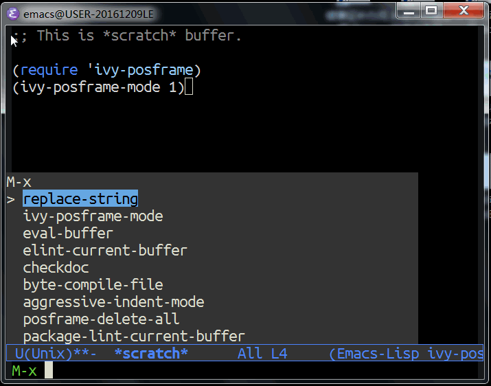
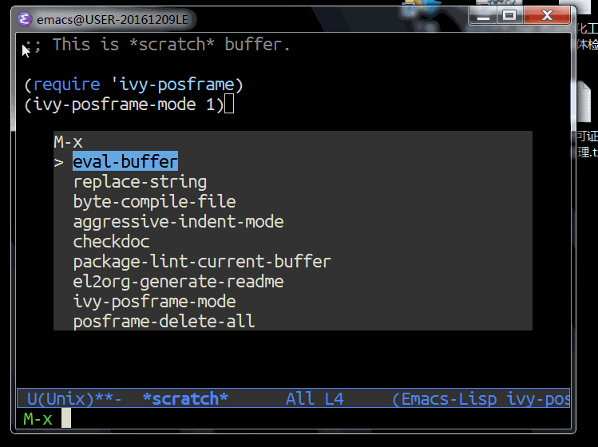

# &#30446;&#24405;

1.  [ivy-posframe README](#org517c951)
    1.  [What is ivy-posframe](#org153958a)
    2.  [How to enable ivy-posframe](#orgfb35379)
    3.  [How to set the style of ivy-posframe](#orgdd1e7a6)

# ivy-posframe README

## What is ivy-posframe

ivy-posframe is a ivy extension, which let ivy use posframe
to show its candidate menu.

NOTE: ivy-posframe requires Emacs 26

## How to enable ivy-posframe

1.  Global mode

        (require 'ivy-posframe)
        (setq ivy-display-function #'ivy-posframe-display)
2.  Per-command mode.

        (require 'ivy-posframe)
        (push '(counsel-M-x . ivy-posframe-display) ivy-display-functions-alist)
3.  Fallback mode

        (require 'ivy-posframe)
        (push '(t . ivy-posframe-display) ivy-display-functions-alist)

## How to set the style of ivy-posframe

1.  window-buttom-left style

        (setq ivy-posframe-style 'window-buttom-left)

    
2.  Window-center style

        (setq ivy-posframe-style 'window-center)

    
3.  Point style

        (setq ivy-posframe-style 'point)

    

Converted from ivy-posframe.el by [el2org](https://github.com/tumashu/el2org) .