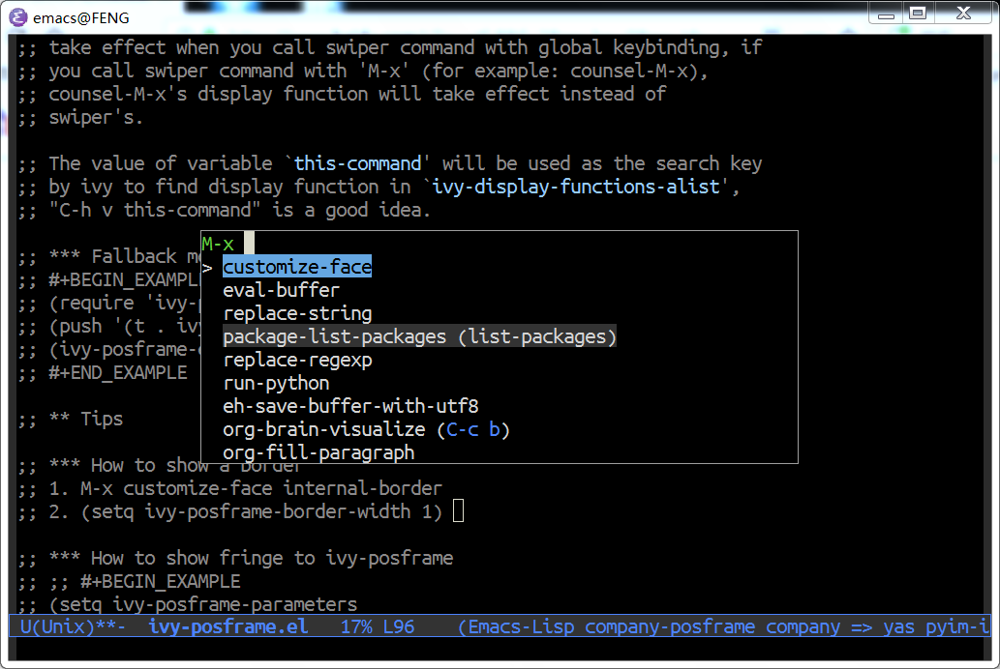
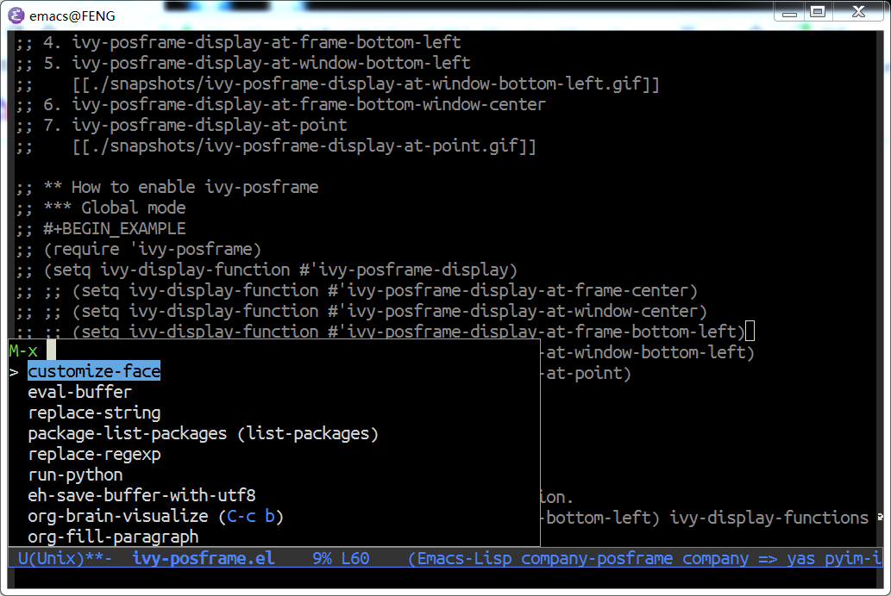
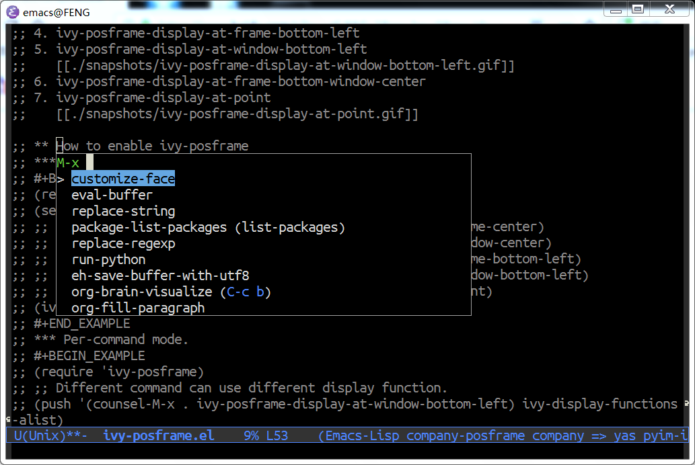

Note: this file is auto converted from ivy-posframe.el by [el2org](https://github.com/tumashu/el2org), please do not edit it by hand!!!

# &#30446;&#24405;

1.  [ivy-posframe README](#org5d8bfea)
    1.  [What is ivy-posframe](#orgfdd7bf8)
    2.  [Display functions](#orgb92156c)
    3.  [How to enable ivy-posframe](#org8551bde)
        1.  [Global mode](#org6e76c8a)
        2.  [Per-command mode.](#org92bda7d)
    4.  [Tips](#org0c88487)
        1.  [How to show fringe to ivy-posframe](#org1a9c7a2)
        2.  [How to custom your ivy-posframe style](#org22dcffc)

# ivy-posframe README

## What is ivy-posframe

ivy-posframe is a ivy extension, which let ivy use posframe to show
its candidate menu.

NOTE: ivy-posframe requires Emacs 26 and do not support mouse
click.

## Display functions

1.  ivy-posframe-display
2.  ivy-posframe-display-at-frame-center
3.  ivy-posframe-display-at-window-center
    
4.  ivy-posframe-display-at-frame-bottom-left
5.  ivy-posframe-display-at-window-bottom-left
    
6.  ivy-posframe-display-at-frame-bottom-window-center
7.  ivy-posframe-display-at-point
    

## How to enable ivy-posframe

### Global mode

    (require 'ivy-posframe)
    ;; display at `ivy-posframe-style'
    (setq ivy-posframe-display-functions-alist '((t . ivy-posframe-display)))
    ;; (setq ivy-posframe-display-functions-alist '((t . ivy-posframe-display-at-frame-center)))
    ;; (setq ivy-posframe-display-functions-alist '((t . ivy-posframe-display-at-window-center)))
    ;; (setq ivy-posframe-display-functions-alist '((t . ivy-posframe-display-at-frame-bottom-left)))
    ;; (setq ivy-posframe-display-functions-alist '((t . ivy-posframe-display-at-window-bottom-left)))
    ;; (setq ivy-posframe-display-functions-alist '((t . ivy-posframe-display-at-frame-top-center)))
    (ivy-posframe-mode 1)

### Per-command mode.

    (require 'ivy-posframe)
    ;; Different command can use different display function.
    (setq ivy-posframe-display-functions-alist
          '((swiper          . ivy-posframe-display-at-point)
            (complete-symbol . ivy-posframe-display-at-point)
            (counsel-M-x     . ivy-posframe-display-at-window-bottom-left)
            (t               . ivy-posframe-display)))
    (ivy-posframe-mode 1)

You can use ivy original display function on specify function.
You may want to use the original display function because display
of Swiper at point hides the contents of the buffer.

    (require 'ivy-posframe)
    ;; Different command can use different display function.
    (setq ivy-posframe-display-functions-alist
          '((swiper          . ivy-display-function-fallback)
            (complete-symbol . ivy-posframe-display-at-point)
            (counsel-M-x     . ivy-posframe-display-at-window-bottom-left)
            (t               . ivy-posframe-display)))
    (ivy-posframe-mode 1)

You may want to change the height of ivy by a function only while
using posframe. This is possible with the code below.

The following example displays swiper on 20 lines by default for ivy,
and displays other functions in posframe at the location specified on
40 lines.

    (require 'ivy-posframe)
    ;; Different command can use different display function.
    (setq ivy-posframe-height-alist '((swiper . 20)
                                      (t      . 40)))
    
    (setq ivy-posframe-display-functions-alist
          '((swiper          . ivy-display-function-fallback)
            (complete-symbol . ivy-posframe-display-at-point)
            (counsel-M-x     . ivy-posframe-display-at-window-bottom-left)
            (t               . ivy-posframe-display)))
    (ivy-posframe-mode 1)

NOTE: Using swiper as example: swiper's display function **only**
take effect when you call swiper command with global keybinding, if
you call swiper command with 'M-x' (for example: counsel-M-x),
counsel-M-x's display function will take effect instead of
swiper's.

The value of variable \`this-command' will be used as the search key
by ivy to find display function in \`ivy-display-functions-alist',
"C-h v this-command" is a good idea.

## Tips

### How to show fringe to ivy-posframe

    (setq ivy-posframe-parameters
          '((left-fringe . 8)
            (right-fringe . 8)))

By the way, User can set **any** parameters of ivy-posframe with
the help of \`ivy-posframe-parameters'.

### How to custom your ivy-posframe style

The simplest way is:

    (defun ivy-posframe-display-at-XXX (str)
      (ivy-posframe--display str #'your-own-poshandler-function))
    (setq ivy-posframe-display-functions-alist '((t . ivy-posframe-display-at-XXX)))
    (ivy-posframe-mode 1) ; This line is needed.

